# lidar-viewer

A WebGL2-accelerated drone LiDAR point cloud viewer built as a pnpm monorepo.

- **Web**: React + Vite, Three.js WebGL2 renderer with EDL, GPU depth sort, UBOs  
- **Mobile**: Expo / React Native WebView wrapping the web viewer  
- **Formats**: Potree 2.0 octrees, COPC / LAS 1.4 via HTTP range requests  
- **Tools**: Distance, area, volume, height, angle measurements (ported from Potree 1.8)  
- **Deploy**: Docker + nginx with CORS + `Accept-Ranges` for COPC streaming  

---

## Screenshots

### Landing page — open a sample or drop your own file

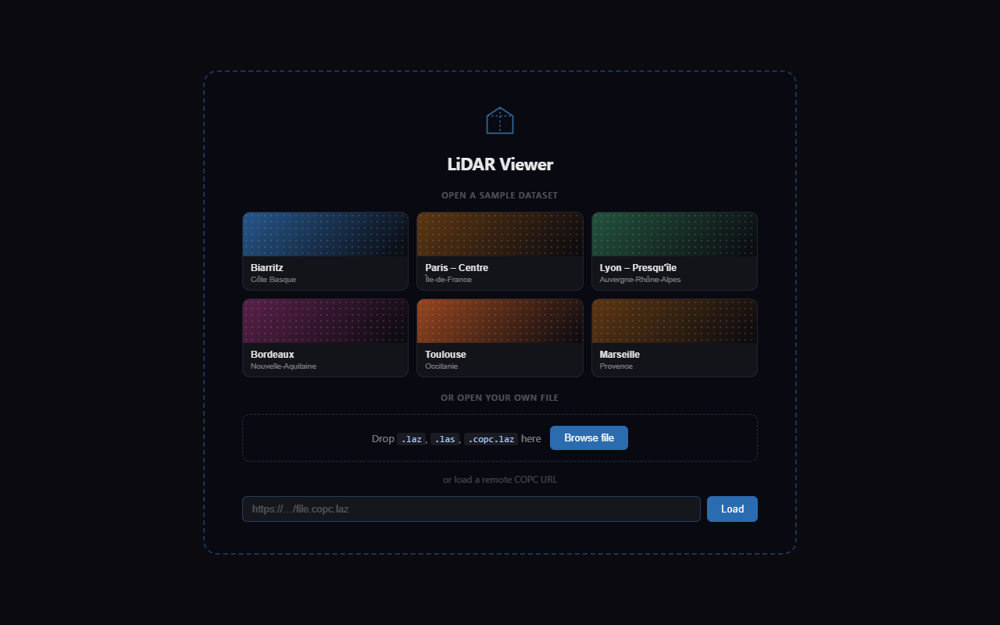

### 3D viewer — four colour modes

| Intensity (fallback when no RGB — IGN LiDAR HD PDRF 6) | Classification |
|---|---|
| 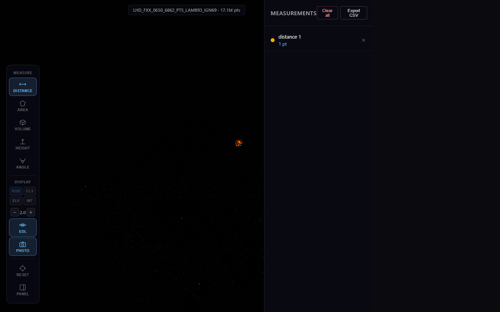 | 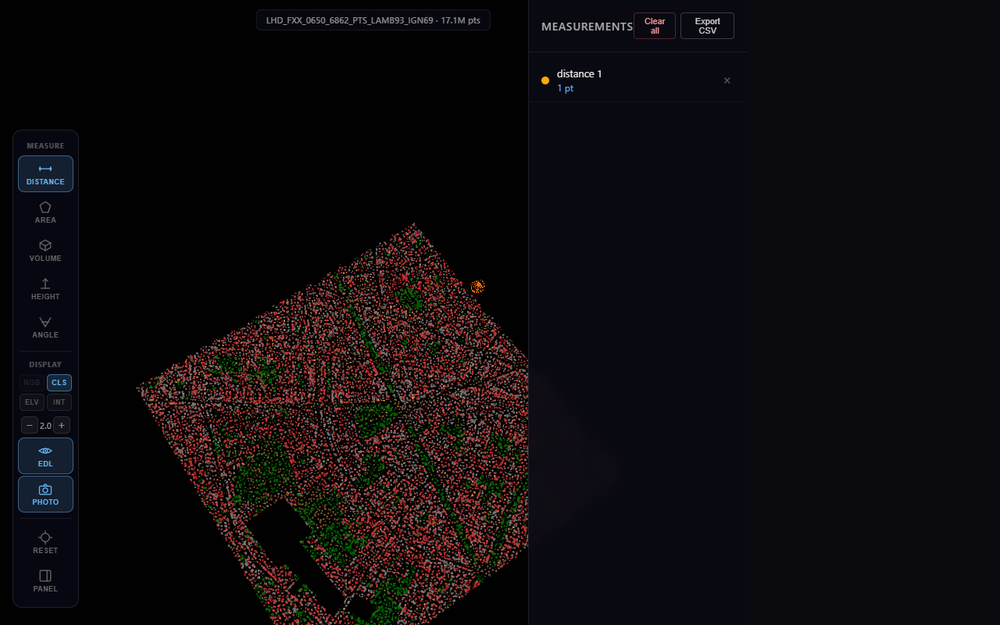 |

| Elevation ramp | Return intensity |
|---|---|
| 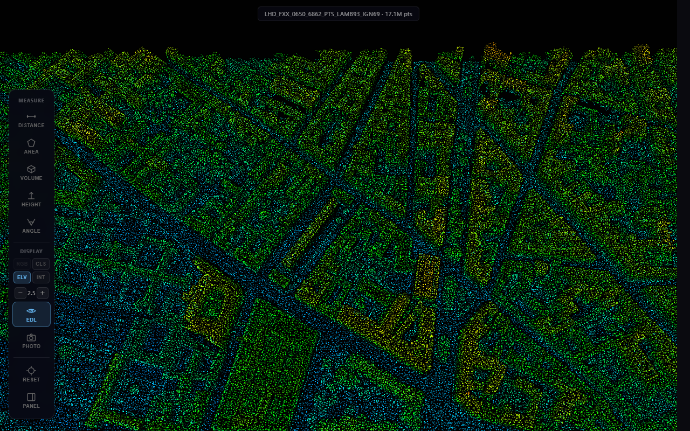 | 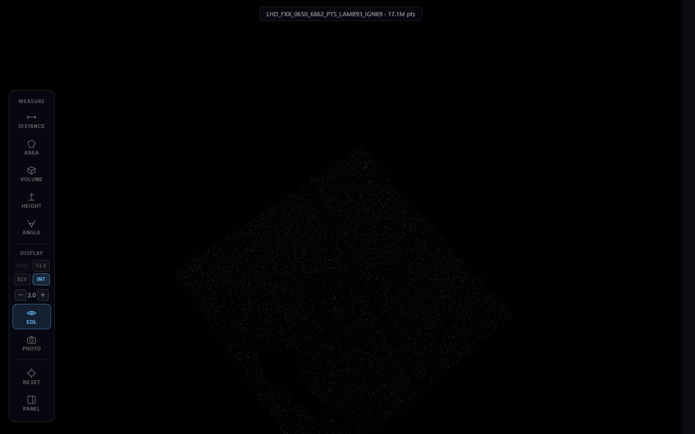 |

### Gaussian splat (Photo) mode — smoother surfaces

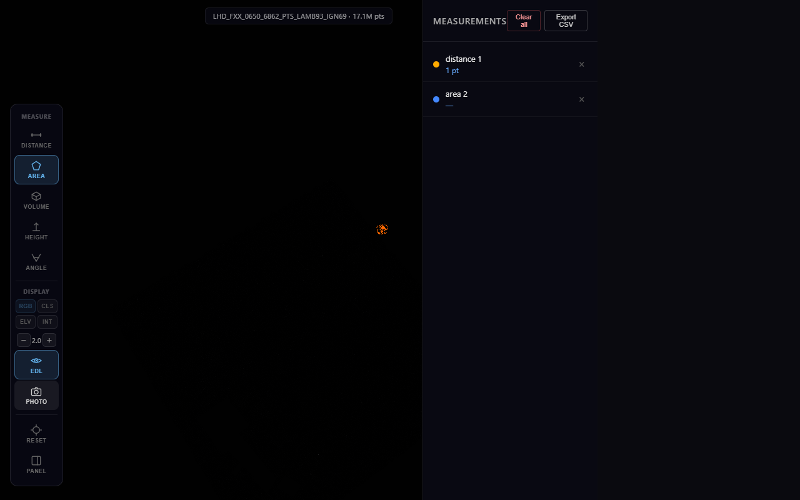

### Toolbar

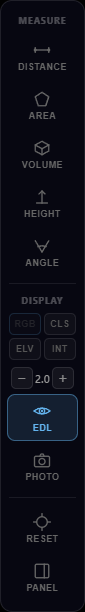

Measure distances, areas, volumes, heights and angles directly in the viewer. Results appear in the panel on the right with one-click CSV export.

| Distance | Area |
|---|---|
| 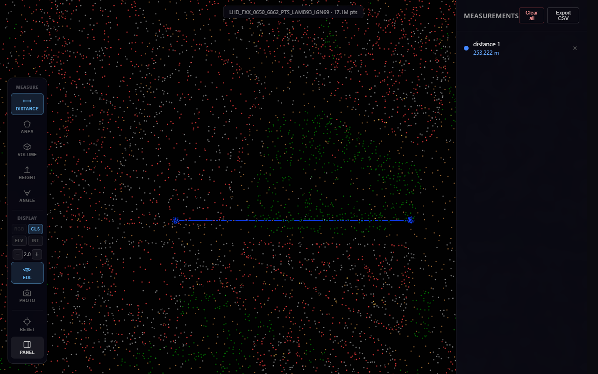 | 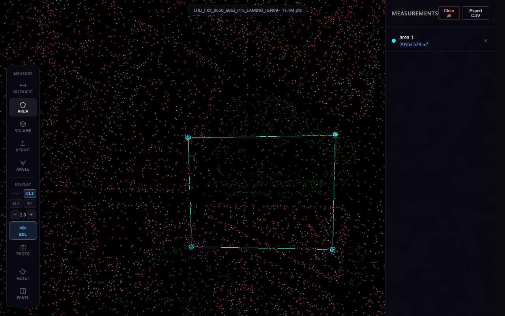 |

| Volume | Height |
|---|---|
| 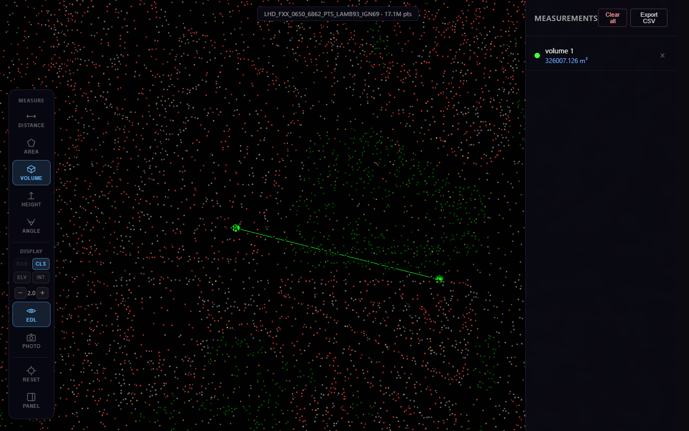 | 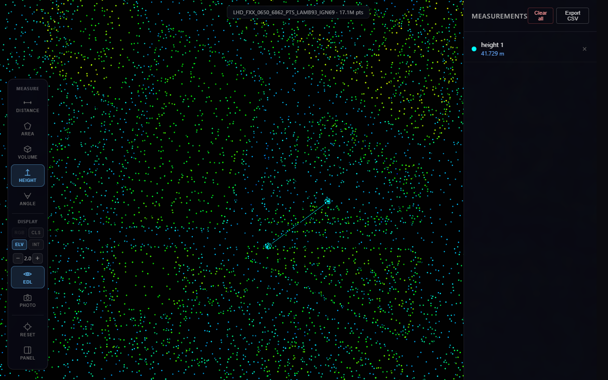 |

---

## Monorepo structure

```
packages/
  core/         WebGL2-enhanced Potree 2.0 loader & renderer
  copc/         COPC / LAS 1.4 HTTP range-request loader
  measurements/ Distance / area / volume measurement tools
  web/          React + Vite viewer application
  mobile/       Expo / React Native WebView wrapper
docker/         nginx config + Dockerfile + docker-compose
```

---

## Quick start (local development)

```bash
# Prerequisites: Node >= 20, pnpm >= 10
npm install -g pnpm

# Install all workspace dependencies
pnpm install

# Start the web viewer in dev mode (hot-reload)
pnpm --filter @lidar-viewer/web dev

# Open http://localhost:5173 and drop a .laz / .copc.laz file
```

---

## Building for production

```bash
# Build all library packages then the web app
pnpm --filter @lidar-viewer/core build
pnpm --filter @lidar-viewer/copc build
pnpm --filter @lidar-viewer/measurements build
pnpm --filter @lidar-viewer/web build

# Output is in packages/web/dist/
```

---

## Docker deployment

```bash
# Copy example env and edit as needed
cp .env.example .env

# Create data directory and drop your .laz / .copc.laz files into it
mkdir -p docker/data/pointclouds
cp my-survey.copc.laz docker/data/pointclouds/

# Build and start
docker compose -f docker/docker-compose.yml up --build

# Access on port 80 (or 8080 from LAN)
```

The nginx config serves point cloud files from `/data/pointclouds/` with the
`Accept-Ranges: bytes` and CORS headers required for COPC chunk streaming.

---

## Mobile (Expo / React Native)

The mobile app opens the web viewer inside a WebView and adds:
- Native file picker for `.laz` / `.las` files via `expo-document-picker`
- `postMessage` bridge to load local files into the viewer

```bash
cd packages/mobile
npx expo install   # installs Expo-compatible versions
npx expo start     # scan QR with Expo Go app
```

Set your LAN IP in `.env`:
```
EXPO_PUBLIC_VIEWER_URL=http://192.168.1.100:5173
```

---

## Point cloud pipeline (drone LiDAR)

```
Drone flight  →  raw .las / .laz
     ↓
PDAL (coordinate transform, noise filter, ground classification)
     ↓
Potree Converter  →  Potree 2.0 octree  →  served via nginx
         or
untwine / PDAL writers.copc  →  .copc.laz  →  served via nginx
```

### Convert to COPC with PDAL

```bash
pdal translate input.las output.copc.laz \
  --writers.copc.filename=output.copc.laz
```

### Convert to Potree octree

```bash
# Using PotreeConverter
./PotreeConverter input.las -o ./output --output-format LAZ
```

---

## Device tier routing

| Tier | Condition | Renderer |
|------|-----------|----------|
| A | WebGPU desktop | WebGPU (future) |
| B | WebGPU mobile | WebGPU with reduced budget |
| C | WebGL2 desktop | Full WebGL2 (EDL, UBOs, transform feedback) |
| D | WebGL2 mobile | Reduced point budget, simpler EDL |

The FPS watchdog steps down the tier if FPS drops below 25 for 3 seconds.

---

## Tech stack

| Layer | Technology |
|-------|-----------|
| Language | TypeScript 5.7, strict mode |
| Monorepo | pnpm workspaces + Turborepo |
| 3D engine | Three.js 0.172 |
| WebGL2 | Transform Feedback, UBOs, MRT, instanced drawing |
| Build | Vite 6 (app), tsc (libraries) |
| Workers | Web Worker (off-main-thread octree traversal) |
| Frontend | React 19, CSS Modules |
| Mobile | Expo SDK 52, react-native-webview |
| Deploy | nginx 1.27-alpine, Docker Compose |
